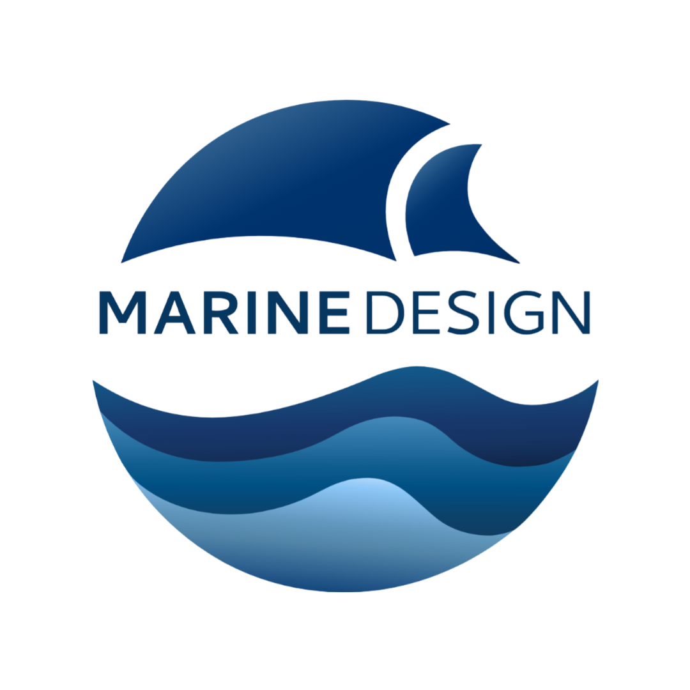

<!-- _coverpage.md -->

# Marine Design

> Software Repository Documentation

- ROS2
- C++ and Python
- Jetson Orin Nano
- Arduino

[GitHub](https://github.com/Okangan-Marine-Design/Cascade)
[Get Started](#main)
